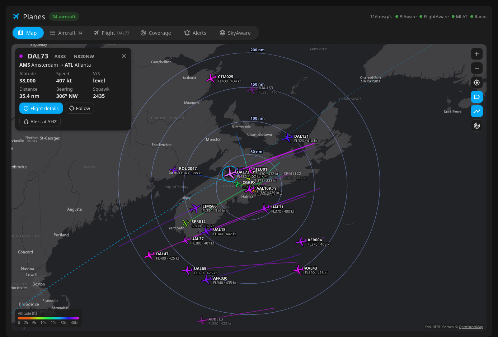
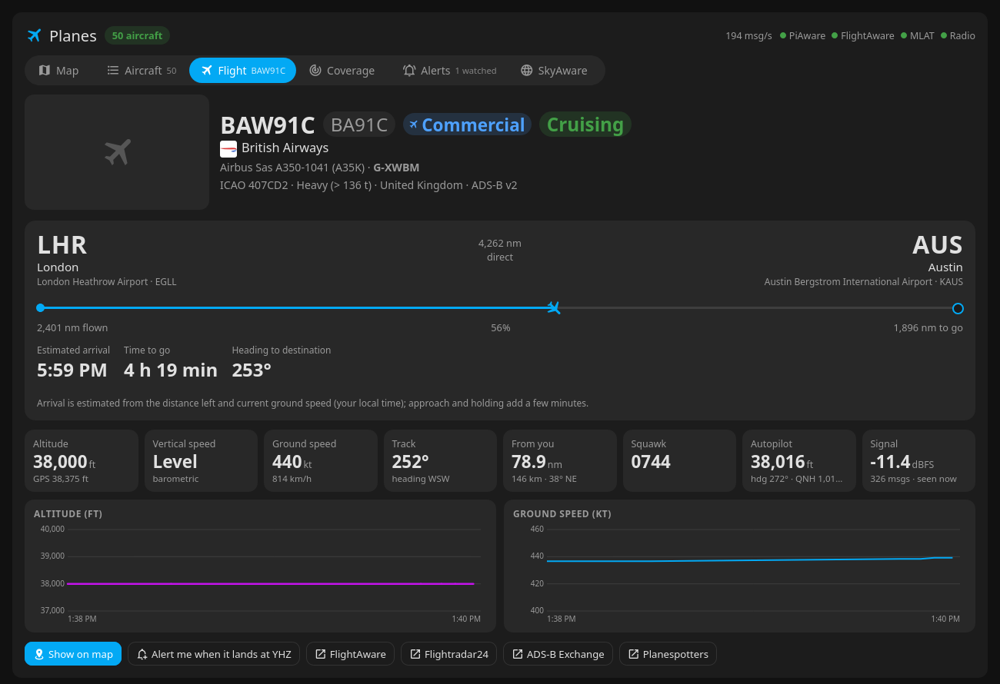
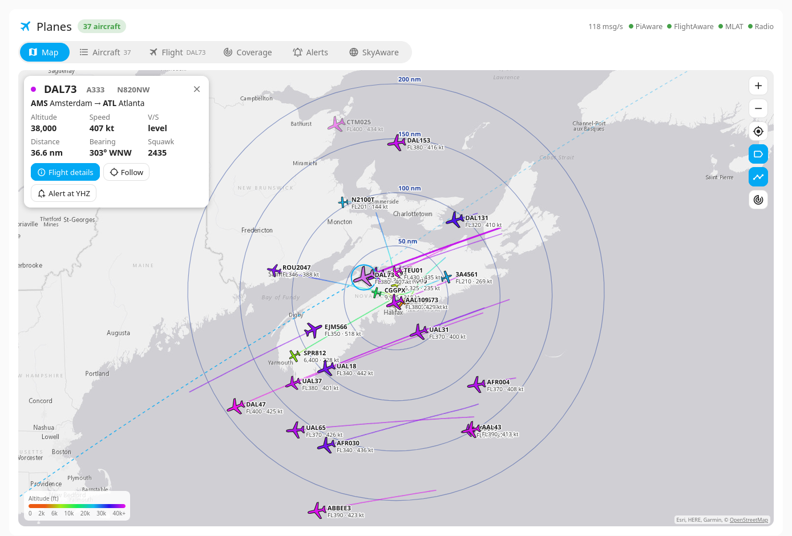
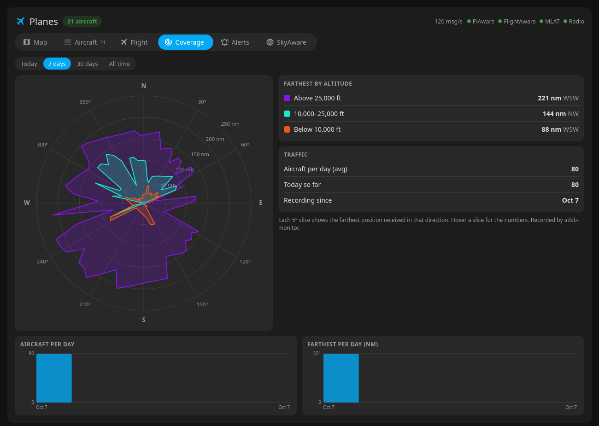
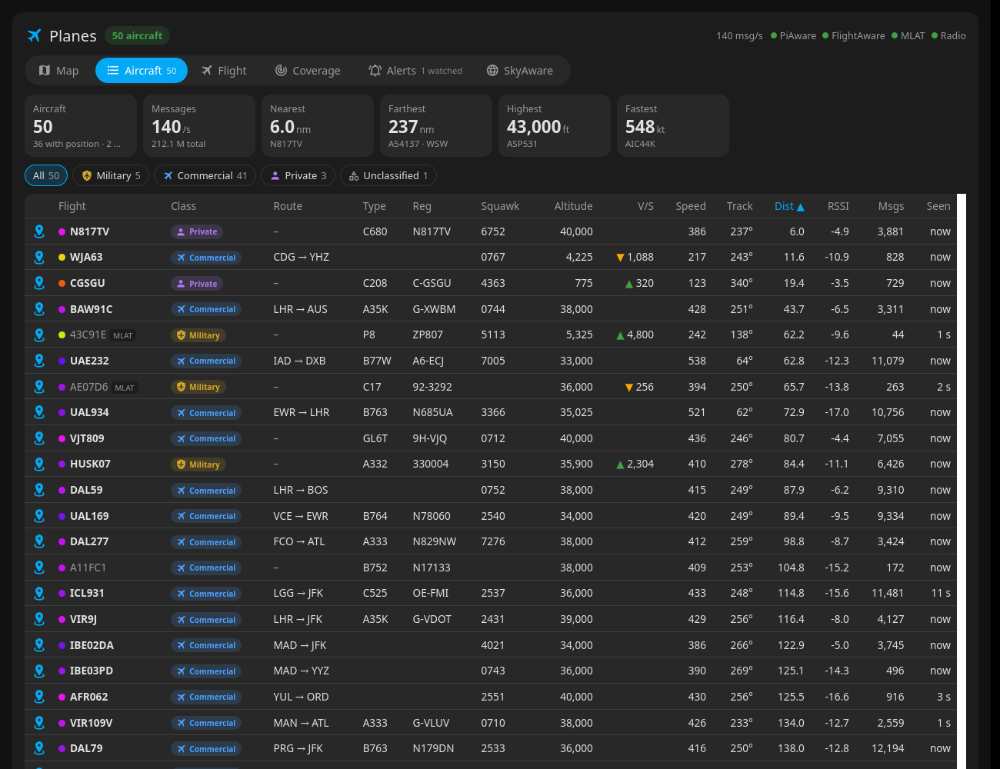
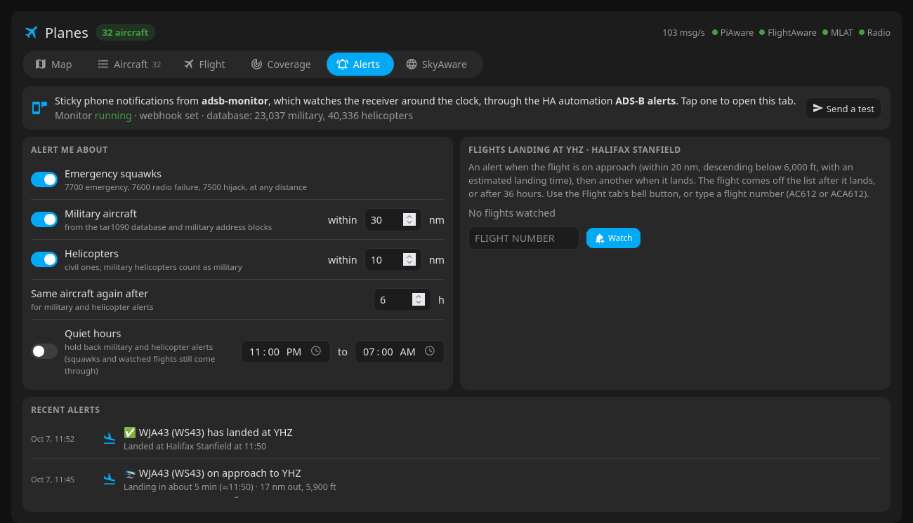
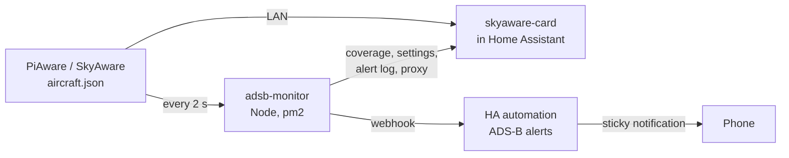

# adsb-monitor + SkyAware card

**A Home Assistant dashboard for your PiAware / ADS-B receiver, with phone alerts and coverage history.**

Two pieces that work together:

- **`skyaware-card`**: a Home Assistant Lovelace card with six tabs. A live map with range rings and altitude-coloured
  trails, a sortable aircraft list, a flight page (route, progress, estimated arrival, photo, live data), a
  coverage polar chart, alert settings, and your original SkyAware page.
- **`adsb-monitor`**: a small always-on Node service (no dependencies) that watches your receiver 24/7. It records
  coverage, sends alerts to your phone through Home Assistant, and proxies SkyAware with CORS so the card also works
  away from home over a VPN.

> [!IMPORTANT]
> **The card alone** (installable from HACS) gives you the Map, Aircraft, Flight and SkyAware tabs, straight from
> your PiAware. **Coverage history, phone alerts, the PiAware status lights and access away from home** need
> **adsb-monitor**, a small background service you run yourself. It needs Node.js 22+ on any always-on Linux machine
> on your network (the PiAware Pi itself works), kept running with pm2 or systemd. HACS can't install it for you;
> see [Install → 1. The monitor](#1-the-monitor).



| Flight status | Light theme |
|---|---|
|  |  |

| Coverage | Aircraft | Alerts |
|---|---|---|
|  |  |  |

## Features

### The card
- **Map**: aircraft drawn as jet / light aircraft / helicopter silhouettes, rotated to their track and coloured
  by altitude like SkyAware (MLAT positions outlined in blue). Range rings, callsign and altitude/speed labels, and
  trails pre-filled from SkyAware's history. Drag, wheel, pinch and double-click to zoom; follow a selected aircraft;
  draw its route as a great circle to its airports; overlay your 30-day coverage outline. Dark or light basemap
  follows your HA theme (Esri gray canvas, no API key needed).
- **Aircraft**: summary tiles (count, msg/s, nearest, farthest, highest, fastest) and a table sortable by any
  column: flight, class, route, type, registration, squawk, altitude, vertical rate, speed, track, distance, RSSI,
  messages, last seen. Each aircraft gets a class tag, **Commercial, Military, Helicopter, Private, Unclassified or
  Unknown**, and chips with counts filter the list by class. The tag also shows in the map popup and on the Flight
  tab.
  - Military comes from the monitor's database (or military address blocks and callsigns without it); helicopter
    from ADS-B category A7 or the database.
  - Private: the callsign is a registration (N123AB, CGABC…), or it's a light/small aircraft.
  - Commercial: an airline-style callsign (ACA612), or, with no callsign yet, an airline owner or a large/heavy jet.
- **Flight**: photo, callsign and IATA flight number, airline and logo, type, registration and owner. Origin →
  destination with a progress bar, distance flown and to go, **estimated arrival time**, and flight phase (climbing,
  cruising, descending, on approach). Live altitude, vertical rate, speed, track, distance and bearing from you,
  squawk, autopilot (selected altitude, heading, QNH, modes) and signal. Altitude and speed charts. Links to
  FlightAware, Flightradar24, ADS-B Exchange and Planespotters. A bell button: **Alert me when it lands**.
- **Coverage**: polar chart of the farthest position heard in each 5° of bearing, for three altitude bands, over
  today / 7 days / 30 days / all time, with records and per-day charts.
- **Alerts**: everything below, as switches, plus a test button and the alert log.
- **SkyAware**: your original SkyAware page, embedded.
- Emergency squawks (7500 / 7600 / 7700) show as a red pill in the header and a red ring on the map.

### The monitor
- **Phone alerts** (as sticky notifications through Home Assistant):
  - **Emergency squawks**: 7700, 7600 or 7500, or an ADS-B emergency status, at any distance. It must be seen on two
    polls in a row, since a single garbled squawk is common.
  - **Military aircraft nearby**: uses the military flag in
    [wiedehopf/tar1090-db](https://github.com/wiedehopf/tar1090-db) (downloaded weekly), plus known military ICAO
    address blocks and callsign prefixes.
  - **Helicopters nearby**: ADS-B category A7, or an aircraft type whose ICAO class is a helicopter.
  - **A watched flight landing at your airport**: first "on approach" (within 20 nm, below 6,000 ft, descending)
    with an estimated landing time, then "landed", which replaces it on the phone. Type a ticket-style flight
    number (AC612) or a callsign (ACA612), or tap the bell on the Flight tab. If your receiver loses the plane low
    on short final, which is common, it counts as landed 90 s later.
  - Alerts include a photo (Planespotters) and route when available. You can set a per-aircraft cooldown and quiet
    hours; quiet hours never hold back emergencies or watched flights.
- **Coverage history**: the farthest position per 5° bearing and altitude band, per day (kept 60 days) and all
  time, with the flight that set each record. A position only counts if it agrees with the aircraft's previous one,
  so CPR decoding glitches and MLAT jumps don't inflate your range.
- **Proxy**: `/skyaware/*` and PiAware's `/status.json` with CORS headers, for the card's status lights and for
  use away from home.

## How it fits together



## Requirements
- A PiAware feeder, or any **dump1090-fa** with **SkyAware** (it serves `data/aircraft.json` with
  `Access-Control-Allow-Origin: *`). Tested with PiAware / SkyAware 11.1.
- **Home Assistant**, for the card and for notifications (the companion app on your phone).
- For the monitor: **Node.js 22+** on any always-on Linux box (the PiAware Pi itself works), kept running by pm2
  or systemd. Raspberry Pi OS's own `nodejs` package is often older; install 22 from
  [NodeSource](https://github.com/nodesource/distributions) or with nvm. It uses ~150 MB of RAM and little CPU.
- HA served over plain `http` on your LAN. If your HA is `https`, the card can't call `http` addresses (mixed
  content), so put the monitor behind https too.

## Install

### 1. The monitor
```bash
git clone https://github.com/jchisholm59/adsb-monitor.git
cd adsb-monitor
cp .env.example .env
nano .env                         # PIAWARE, AIRPORT, HA_WEBHOOK (see below)
npm i -g pm2                      # if you don't have it
pm2 start ecosystem.config.js && pm2 save
curl http://localhost:7100/api/status
```
It must keep running (it's what records coverage and sends alerts), so use pm2 as above, or a systemd service:
```ini
# /etc/systemd/system/adsb-monitor.service
[Unit]
Description=adsb-monitor
After=network-online.target

[Service]
User=pi
WorkingDirectory=/home/pi/adsb-monitor
ExecStart=/usr/bin/node server.js
Restart=always

[Install]
WantedBy=multi-user.target
```
`sudo systemctl enable --now adsb-monitor`. Data lives in `data/`. That's settings, coverage and the alert log, plus the
downloaded aircraft database (~8 MB, refreshed weekly) and your airport.

### 2. The card
**With HACS:** HACS → ⋮ → Custom repositories → add `https://github.com/jchisholm59/adsb-monitor`, type
*Dashboard*, then download **SkyAware Card**. HACS adds the resource for you.

**By hand:**
1. Copy `dist/skyaware-card.js` to `/config/www/` on Home Assistant.
2. Settings → Dashboards → ⋮ → Resources → Add: `/local/skyaware-card.js`, type *JavaScript module*.
   (After updating the file, change it to `/local/skyaware-card.js?v=2`, `?v=3`… so browsers reload it.)

**Then** add a view (a *Panel* view gives the map the whole screen) with:
   ```yaml
   type: custom:skyaware-card
   urls:                              # your PiAware; first that answers is used
     - http://192.168.1.50
     - http://100.64.0.10:7100        # optional: the monitor's proxy over Tailscale/VPN, for away from home
   monitor:                           # adsb-monitor (optional, for Coverage / Alerts)
     - http://192.168.1.20:7100
     - http://100.64.0.10:7100
   ```

### 3. Phone alerts
1. In Home Assistant, create an automation from [`ha-automation.yaml`](ha-automation.yaml). Pick a long random
   webhook ID and put in your phone's notify action (`notify.mobile_app_<your_phone>`).
2. In the monitor's `.env`: `HA_WEBHOOK=http://<your-ha>:8123/api/webhook/<that id>`, then
   `pm2 restart adsb-monitor --update-env`.
3. In the card's **Alerts** tab press **Send a test**.

The webhook is `local_only`, so the monitor must be on the same network as HA. It needs no HA token.

## Configuration

### `.env` (monitor)
| Variable | Default | |
|---|---|---|
| `PIAWARE` | `http://piaware.local` | Your PiAware / dump1090-fa box |
| `SKYAWARE_PATH` | `/skyaware/` | Where SkyAware is served on it |
| `LAT`, `LON` | from PiAware | Receiver position, only if you want to override PiAware's |
| `AIRPORT` | none | ICAO code of your airport for landing alerts, e.g. `KBOS`, `EGLL`. Looked up in [OurAirports](https://ourairports.com/data/) |
| `AIRPORT_NAME`, `AIRPORT_IATA`, `AIRPORT_LAT`, `AIRPORT_LON`, `AIRPORT_ELEV` | from OurAirports | Overrides (e.g. a shorter name for notifications) |
| `HA_WEBHOOK` | none | HA webhook URL. Empty: alerts are only logged |
| `PORT` | `7100` | API / proxy port |
| `MILITARY_RADIUS`, `HELI_RADIUS` | `30`, `10` | Starting alert distances (nm); then set in the card |
| `COOLDOWN_HOURS` | `6` | Starting per-aircraft cooldown; then set in the card |

### Card options
| Option | Default | |
|---|---|---|
| `urls` | the `monitor` URLs | PiAware base URLs, tried in order |
| `monitor` | none | adsb-monitor base URLs, tried in order |
| `title` | `Planes` | |
| `path` | `/skyaware/` | SkyAware path on PiAware |
| `rings` | `[50, 100, 150, 200]` | Range rings, nm |
| `refresh` | `2` | Seconds between polls |
| `trail_minutes` | `30` | |
| `map_height` | fills the screen | px |
| `lat`, `lon` | from PiAware | Receiver position override |
| `lookups` | `true` | `false` turns off the internet lookups (routes, aircraft details, photos) |

## Data sources
All free, keyless and CORS-enabled. Lookups are cached.
- Routes: [adsb.im](https://adsb.im) `routeset`, which checks each route against the aircraft's position. That
  matters: the bigger free route databases are often years out of date.
- Airline, IATA flight number, aircraft type, registration and owner: [adsbdb.com](https://www.adsbdb.com).
- Photos: adsbdb and [Planespotters.net](https://www.planespotters.net) (with photographer credit).
- Military flags and helicopter types: [tar1090-db](https://github.com/wiedehopf/tar1090-db) and SkyAware's own
  ICAO type table.
- Airports: [OurAirports](https://ourairports.com/data/) (public domain).
- Basemap: Esri World Gray Canvas (Esri, HERE, Garmin, © OpenStreetMap contributors).
- Airline logos: FlightAware's public logo images.

**Privacy:** your receiver's position never leaves your network. The card and monitor send only aircraft
identifiers (hex, callsign) and, for route checks, aircraft positions to the services above.

## Notes
- **Arrival times are estimates**: distance to go divided by current ground speed. Approach and holding add a few
  minutes. Scheduled and actual times would need a paid API such as FlightAware AeroAPI.
- The monitor has no web page of its own, only a JSON API:
  | | |
  |---|---|
  | `GET /api/status` | health, receiver position, PiAware status, webhook set, database counts |
  | `GET /api/coverage` | per-day and all-time farthest range per 5° and altitude band |
  | `GET / PUT /api/settings` | alert settings (partial updates) |
  | `POST /api/watch` | `{"callsign": "ACA612"}` to watch, add `"remove": true` to stop |
  | `GET /api/alerts` | last 100 alerts |
  | `GET /api/classes` | military / helicopter flags (and type, registration) for the aircraft in view |
  | `POST /api/test-alert` | send a test notification |
- Anyone who can reach the monitor's port can change its alert settings. Keep it on your LAN or VPN.

## License
MIT
